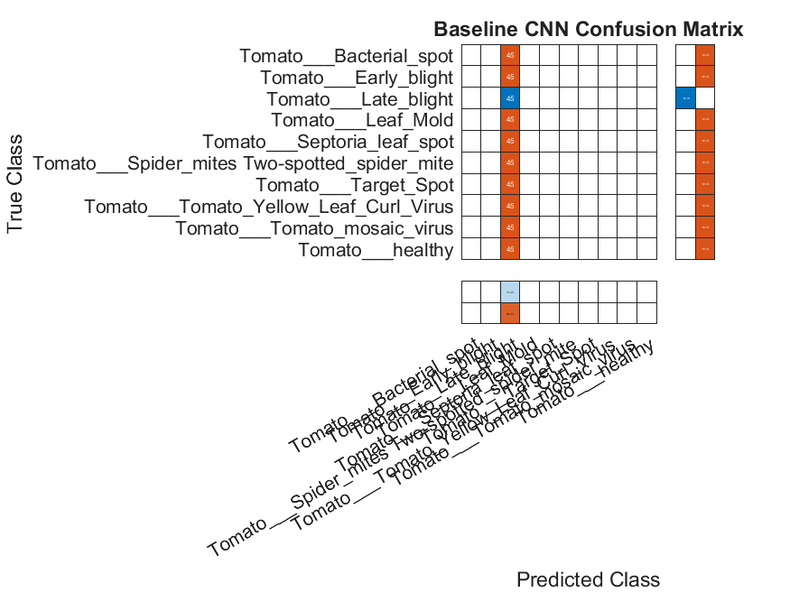

# Plant Disease Classification Using Deep Learning and Transfer Learning

## Overview

This project presents a tomato plant disease classification system using deep learning and transfer learning techniques in MATLAB.

Two different approaches were implemented and compared:

1. Baseline Convolutional Neural Network (CNN)
2. ResNet-18 Transfer Learning

The objective is to evaluate the effectiveness of transfer learning for plant disease recognition using tomato leaf images from the PlantVillage dataset.

---

## Dataset

Dataset: PlantVillage Dataset

Source:
https://github.com/spMohanty/PlantVillage-Dataset

### Selected Classes

- Tomato Bacterial Spot
- Tomato Early Blight
- Tomato Late Blight
- Tomato Leaf Mold
- Tomato Septoria Leaf Spot
- Tomato Spider Mites
- Tomato Target Spot
- Tomato Yellow Leaf Curl Virus
- Tomato Mosaic Virus
- Tomato Healthy

To reduce computational cost, 300 images were randomly selected from each class.

Total Images Used:

3000 images

---

## Experimental Setup

| Parameter | Value |
|------------|------------|
| Image Size | 224 × 224 × 3 |
| Train Split | 70% |
| Validation Split | 15% |
| Test Split | 15% |
| Optimizer | Adam |
| Batch Size | 32 |
| Epochs | 5 |

---

## Models

### Baseline CNN

Custom CNN architecture consisting of:

- Convolution Layers
- Batch Normalization
- ReLU Activation
- Max Pooling
- Fully Connected Layers

File:

```text
final_project.m
```

---

### ResNet-18 Transfer Learning

Pretrained ResNet-18 network with modified final classification layers.

File:

```text
resnet_transfer_learning.m
```

---

## Results

| Model | Accuracy |
|---------|---------|
| Baseline CNN | 10.00% |
| ResNet-18 Transfer Learning | 91.78% |

The transfer learning approach significantly outperformed the baseline CNN model.

---

## Confusion Matrices

### Baseline CNN



### ResNet-18 Transfer Learning


---

## Repository Structure

```text
Plant-Disease-Classification-MATLAB/
│
├── final_project.m
├── resnet_transfer_learning.m
├── CNN_Confusion_Matrix.png
├── ResNet18_ConfusionMatrix.png
├── Final_Project_Results.xlsx
├── ResNet18_Results.xlsx
├── README.md
```

---

## Requirements

- MATLAB R2023a or later
- Deep Learning Toolbox
- Deep Learning Toolbox Model for ResNet-18 Network

---

## Author

Sevinç Taşer

Department of Electrical and Electronics Engineering

Abdullah Gül University

Kayseri, Türkiye


