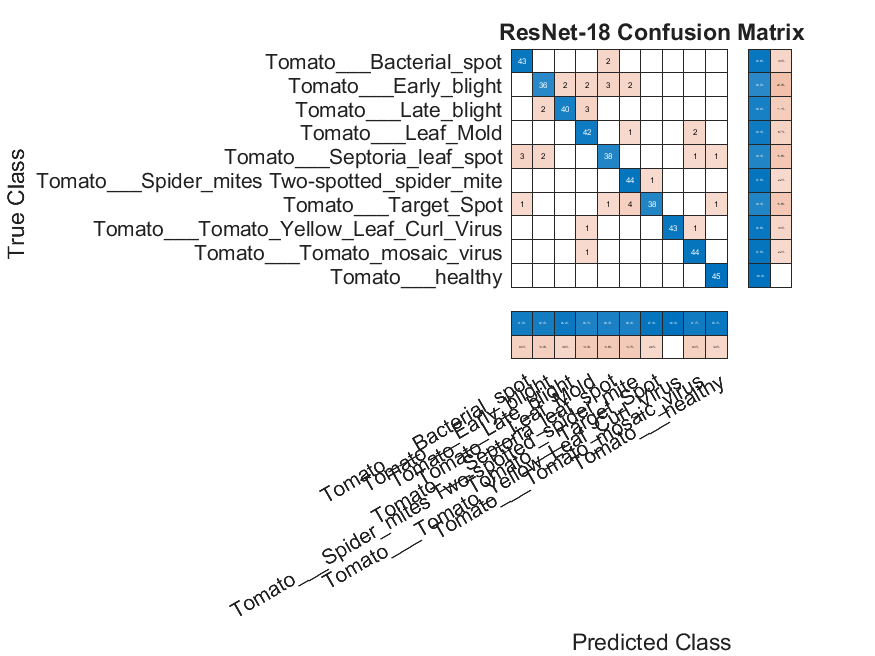

# Plant Disease Classification Using Deep Learning and Transfer Learning

## Overview

This project presents a tomato plant disease classification system using deep learning and transfer learning techniques implemented in MATLAB.

Two different approaches were developed and compared:

1. Baseline Convolutional Neural Network (CNN)
2. ResNet-18 Transfer Learning

The objective is to evaluate the effectiveness of transfer learning for tomato leaf disease classification using images from the PlantVillage dataset.

---

## Dataset

**Dataset:** PlantVillage Dataset

**Source:**
https://github.com/spMohanty/PlantVillage-Dataset

### Selected Classes

* Tomato Bacterial Spot
* Tomato Early Blight
* Tomato Late Blight
* Tomato Leaf Mold
* Tomato Septoria Leaf Spot
* Tomato Spider Mites
* Tomato Target Spot
* Tomato Yellow Leaf Curl Virus
* Tomato Mosaic Virus
* Tomato Healthy

To reduce computational cost and ensure balanced classes, **300 images were randomly selected from each class**.

### Dataset Statistics

| Split      | Images |
| ---------- | -----: |
| Training   |  2,100 |
| Validation |    450 |
| Test       |    450 |
| Total      |  3,000 |

---

## Experimental Setup

| Parameter        | Value         |
| ---------------- | ------------- |
| Image Size       | 224 × 224 × 3 |
| Train Split      | 70%           |
| Validation Split | 15%           |
| Test Split       | 15%           |
| Optimizer        | Adam          |
| Batch Size       | 32            |

---

## Models

### Baseline CNN

Custom CNN architecture consisting of:

* 3 Convolutional Layers
* Batch Normalization
* ReLU Activation
* Max Pooling
* Fully Connected Layer
* Dropout Layer
* Softmax Classification Layer

#### Architecture Size

| Metric               |     Value |
| -------------------- | --------: |
| Learnable Parameters | 6,447,754 |
| Trainable Parameters | 6,422,656 |
| Layers               |        18 |
| Connections          |     4,640 |

File:

```text
final_project.m
```

---

### ResNet-18 Transfer Learning

A pretrained ResNet-18 model was fine-tuned by replacing the final fully connected and classification layers.

File:

```text
resnet_transfer_learning.m
```

---

## Results

### Classification Accuracy

| Model                          | Epochs | Accuracy |
| ------------------------------ | -----: | -------: |
| Baseline CNN                   |      5 |   10.00% |
| Baseline CNN (Longer Training) |     20 |   10.00% |
| ResNet-18 Transfer Learning    |      5 |   92.22% |

The transfer learning model significantly outperformed the baseline CNN architecture.

---

## Per-Class Performance of ResNet-18

| Class                  | Precision | Recall | F1-Score |
| ---------------------- | --------: | -----: | -------: |
| Bacterial Spot         |      0.94 |   0.98 |     0.96 |
| Early Blight           |      0.89 |   0.71 |     0.79 |
| Late Blight            |      0.89 |   0.89 |     0.89 |
| Leaf Mold              |      0.96 |   0.98 |     0.97 |
| Septoria Leaf Spot     |      0.91 |   0.91 |     0.91 |
| Spider Mites           |      0.91 |   0.93 |     0.92 |
| Target Spot            |      0.86 |   0.93 |     0.89 |
| Yellow Leaf Curl Virus |      1.00 |   0.96 |     0.98 |
| Mosaic Virus           |      0.92 |   0.98 |     0.95 |
| Healthy                |      0.96 |   0.96 |     0.96 |

---

## Confusion Matrices

### Baseline CNN


### ResNet-18 Transfer Learning



---

## Limitations

The experiments were conducted using the PlantVillage dataset, which contains images captured under controlled laboratory conditions. Therefore, the reported performance may not directly represent real-world agricultural environments.

Future work should evaluate the models on field-acquired images and investigate domain adaptation techniques to improve robustness under varying environmental conditions.

---

## Repository Structure

```text
Plant-Disease-Classification-MATLAB/
│
├── final_project.m
├── resnet_transfer_learning.m
├── CNN_20epoch_Confusion_Matrix.png
├── ResNet18_ConfusionMatrix.png
├── CNN_20epoch_Metrics.xlsx
├── CNN_20epoch_Results.xlsx
├── ResNet18_Metrics.xlsx
├── ResNet18_Results.xlsx
├── report.pdf
├── README.md
```

---

## Requirements

* MATLAB R2024a or later
* Deep Learning Toolbox
* Deep Learning Toolbox Model for ResNet-18 Network

---

## Author

**Sevinç Taşer**
Department of Electrical and Electronics Engineering
Abdullah Gül University
Kayseri, Türkiye
